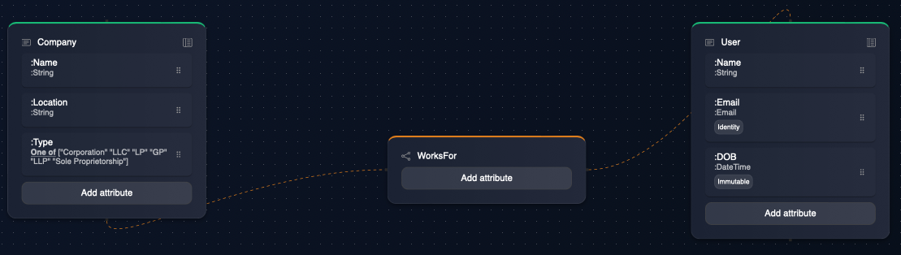
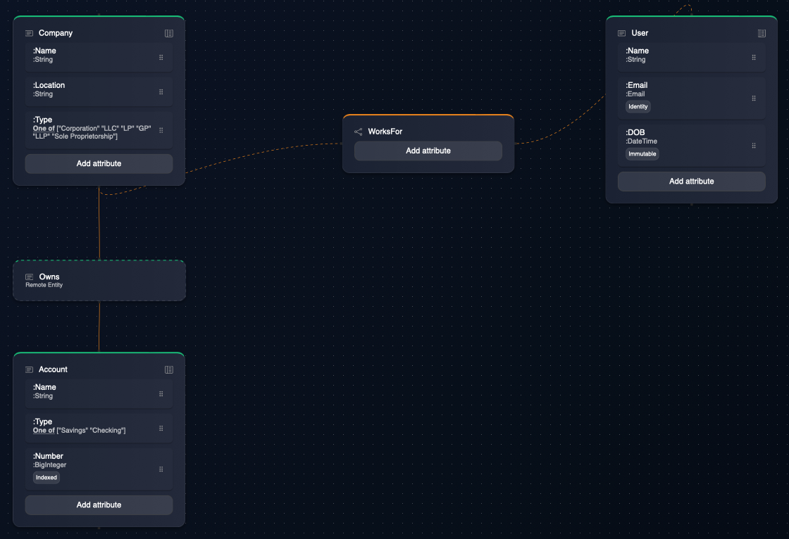

# Graph-based Data Model

**Fractl** introduces an innovative **Graph-based Hierarchical** Data Model. This is a better fit over relational and, even, generic graph-based approaches for most applications in numerous ways:

1. The business domain model - the structure and shape of information in applications - can be very precisely mapped to Fractl's data model.
2. From a developer's perspective, the hierarchical and nested nature of this data model brings a lot of flexiblity to modeling data. It is possible to represent any combination of maps and lists with this data model. Map of list of map of map of list of maps? Bring it on!
3. The data model provides a elegant way for implementing ownership and access-control policies. More on this in the [Zero Trust Programming](zero-trust-programming.md) section.

The following are some salient features of the data model:

* **Entity-relationship Graph**: Domain data is captured as entities. Entities that are related to each other are mutually linked via a relationship. The entities and relationships form a graph, with entities as nodes and relationships as links.

* **Hierarchical**: There are two kinds of relationships - `:contains` and `:between`. While `:between` relationship is a simple association between the two entities, `:contains` relationship form a more structured containment/parent-child relationship. Entities that are related to each other via a `:contains` relationship form a tree. So, the data model ends up being a graph of trees.

* **Paths**:

Since the Entity records of an application are organized as a graph, it is important to be able to address and access a given record from the graph easily. Fractl has a concept of a **path** that uniquely pinpoints to a record in the graph as a node in one of the interconnected trees. This path is available both as a serializable data representation (string) and also as a binding in the context of a computation in a dataflow.

TBD:
* **Type Inheritance**:

