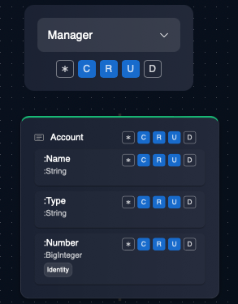
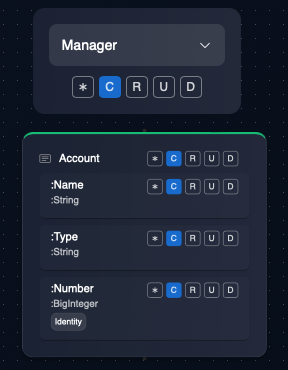

# Zero-trust Programming

By default, Fractl programs do not permit any operations - read or write - on entities and relationship. The developer has to explicitly permit operations on each construct - this enables fine-granular security right in the programming language. Further, Fractl incorporates facilities to add/modify/revoke permissions during runtime, enabling the application security rules to be dynamically modified based on needs.

> **Note**: An "entity" is different from an "instance of an entity" - the former is a type, whereas the latter is a value of that type.

## Fine-granular Access Control

The following are some of the salient security features in Fractl:

* **Role-based Entity Permissions**: Developers can define permissions for users of different roles to perform CRUD operations of entities declaratively. 

In the example above, **any** user of the role "Manager" can perform Create, Read and Update operations, but not Delete operation on the entity and its attributes

* **Instance Ownership-based Permissions**: An instance of an entity created by a user is "owned" by the user. The owner can perform any operation on that entity instance. Role-based Entity Permissions are **too permissive** for most use cases and should be used cautiously. A good pattern is to only allow **Create** permissions for a role and disable other permissions. With this, users associated with the role can only create new instances of the entity and not be able to read/update/modify any other instances. The created entity instances will **now be owned by the user** and this ownership allows the user to perform all **CRUD** operations on that particular instance of the entity (but not on other instances of the same entity).

* **Permissions flow**: The **Graph-based Hierarchical Data Model** introduced by **Fractl** enables a zero-trust programming paradigm with minimal configuration. Permissions flow down the data model tree via the `:contains` relationship links. This permission flow applies both to Role-based permissions and instance ownership-based permissions:
    * **RBAC**: In the example below, any user that belongs to the `manager` role can perform Create, Read, Update operations on entity "Company". As a result, the user can also perform the same exact set of operations on "Account" under "Company".
    * **Instance ownership**: A user who "owns" an instance of the entity "Company" automatically owns all instances of "Account" under "Company".

Also see the documentation on [RBAC](/docs/language/reference/rbac).
