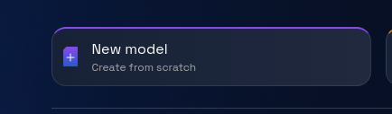
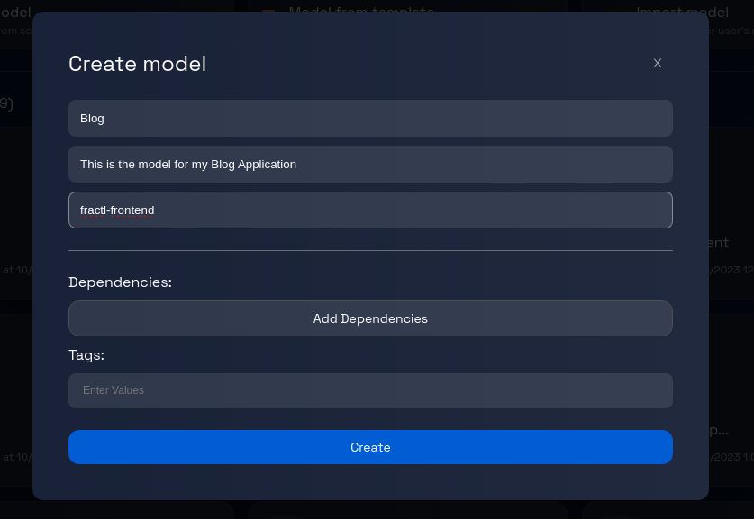
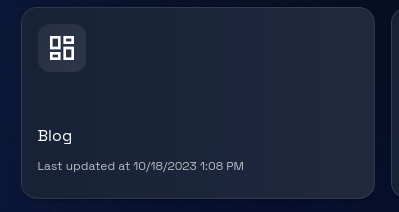

# Creating a Blank Model: Step-by-Step Guide

### **Step 1: Click on "New Model"**

On the platform's homepage or dashboard, locate and click on the "New Model" button. This button is usually prominently displayed to guide you in starting the model creation process.

### **Step 2: Fill in the Model Information**

After clicking on "New Model," a dialogue box will open, presenting you with fields to fill in model information. In the provided fields, enter the following information:

-   **Name**: Choose a suitable name for your model. This could be anything that helps you identify the model's purpose or content.
-   **Description**: Write a brief description that outlines what the model will be used for or what it aims to achieve.
-   **GitHub Organization**: Provide the name of the GitHub organization where you want to store the model.

### **Step 3: Review and Verify Information**

Double-check the information you've entered in the fields to ensure accuracy and clarity.

### **Step 4: Click "Create"**

Once you are satisfied with the entered information, locate the "Create" button at the bottom of the dialogue box and click on it.

### **Step 5: Model Creation Process**

After clicking "Create," the platform will initiate the process of creating your blank model based on the provided information. This process might take a moment, so please be patient.

### **Step 6: Model Created Successfully**

Once the model creation process is complete, you will see the model card appearing on the dashboard.

### **Step 7: Begin Model Customization**

At this point, you have successfully created a blank model. Now you can proceed to customize it according to your needs.

Congratulations! You have successfully created a blank model by following these steps.
