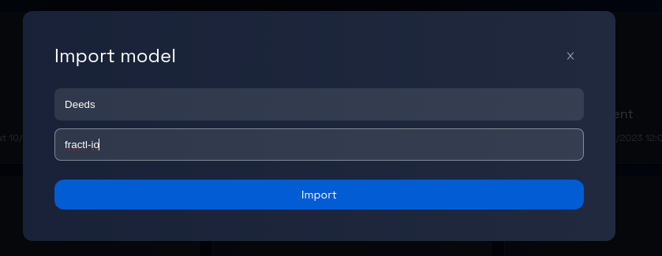
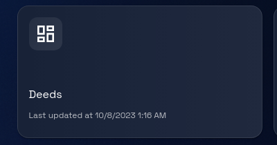

# Importing a Model from GitHub's Organization

### **Step 1: Click on "Import Model"**

On the platform's homepage or dashboard, find and click on the "Import Model" button. This button is usually prominently displayed to guide you in initiating the model import process.

### **Step 2: Open the Import Dialogue Box**

After clicking "Import Model," a dialogue box will appear on your screen. This dialogue box is where you'll enter the necessary information to import the desired model.

### **Step 3: Enter Model Details**

In the dialogue box, there will be fields to input specific information about the model you want to import:

-   **Model Name:** Type in the name of the model you intend to import. This should be the exact name by which the model is identified.
-   **GitHub Organization:** Enter the name of the GitHub organization where the model is stored. This is crucial for the platform to locate and import the correct model.

### **Step 4: Verify Information**

Review the information you've entered in the fields to make sure there are no errors or typos.

### **Step 5: Click "Import"**

Once you are confident that the information is accurate, locate the "Import" button within the dialogue box and click on it.

### **Step 6: Model Import Process**

After clicking "Import," the platform will start the process of fetching the model from the specified GitHub organization.

Depending on the model's size and your internet connection, the import process might take some time. Be patient during this stage.

### **Step 7: Import Confirmation**

Once the import process is complete, you will see the model card on the dashboard.

### **Step 8: Access the Imported Model**

At this point, the imported model should be available within your platform's model list or repository.

### **Step 9: Begin Using the Imported Model**

With the imported model now accessible, you can start using it for your intended tasks.

Congratulations! You have successfully imported a model from GitHub's organization using the steps outlined in this tutorial.
