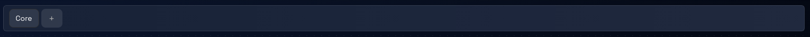
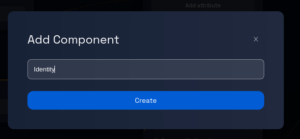
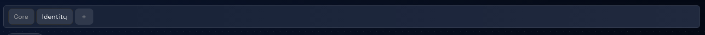

# Creating Components in Models: A Step-by-Step Guide

### **Step 1: Click on the Model Card**

Click on the model card that you want to add a component to. This will take you to the "Data model page".

### **Step 2: Locate the + Button**

On the model's data model page, look for the **"+"** button.

### **Step 3: Open the Create Component Dialogue Box**

Click on the "+" button, and a dialogue box will appear. This is where you will provide the necessary information to create the new component.

### **Step 4: Enter the Component Name**

In the dialogue box, you will see a field labeled "Name". Enter the name of the new component here.

### **Step 5: Click "Create"**

Verify the component name and click the the "Create" button.
Design Studio will process your request and generate the new component within the selected model, this process may take a few seconds.

### **Step 6: Confirmation and Completion**

Once the component creation process is complete, you will see the component’s tab at the top of the Data model page.

Congratulations! You have successfully created a component within a model.
