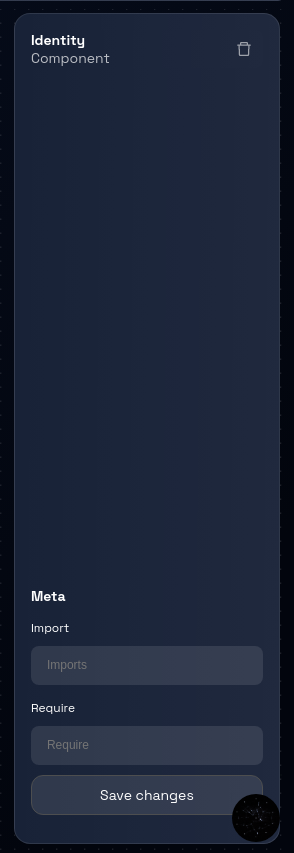
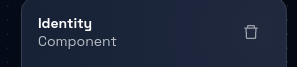
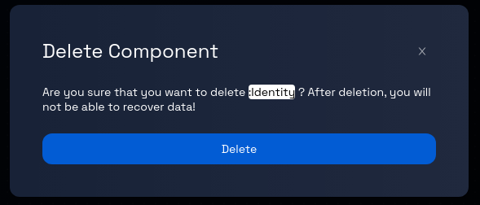

# Deleting Components from Data Models: A Step-by-Step Guide

### **Step 1: Click on the Model Card**

In the Design Studio dashboard, click on the card representing the desired model. This will take you to the "Data model" page.

### **Step 2: Select the Component**

On the data model page, use one of the following methods to select the component you want to delete:

- **Method 1:** Click on the tab representing the component at the top of the page.
- **Method 2:** Find the component's name in the left panel and click on it.

### **Step 3: Open the Component's Panel**

Upon selecting the component, a panel will open on the right-hand side of the page. This panel contains information related to the chosen component.

### **Step 4: Delete the Component**

Within the opened component panel, locate and click on the "trash" icon. This icon is used to initiate the process of deleting the selected component.

### **Step 5: Confirmation Prompt**

After clicking the "trash" icon, you will receive a confirmation prompt to ensure you want to proceed with the deletion. This prompt is designed to prevent accidental deletion.

### **Step 6: Confirm Deletion**

If you are certain about the deletion, proceed by clicking the "Delete" button, as indicated in the prompt. (To cancel the delete request, click the `X` button on the top-right corner of the prompt.)

### **Step 7: Component Deletion Process**

After confirming the deletion, the Design Studio will begin the process of removing the selected component from the data model.

### **Step 8: Review and Continue**

Review the Data model page to ensure that the deleted component is no longer present.

Congratulations! You've successfully learned how to delete a component from a data model.
