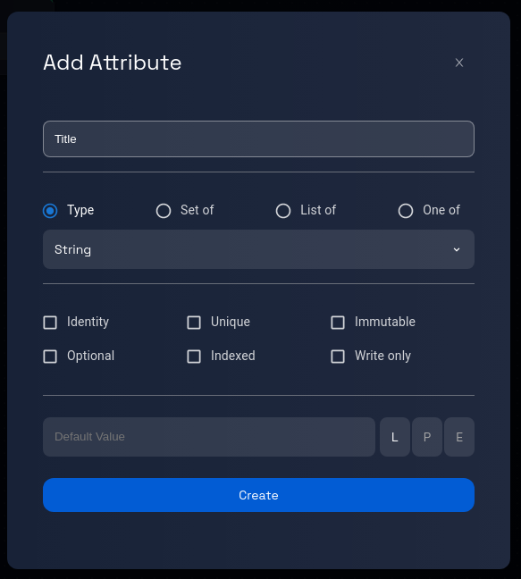

# Add an Attribute

### **Step 1: Click on the Model Card**

Locate the model card that you want to add a component to. Click on the card representing the desired model. This will take you to the data model page for that particular model.

### **Step 2: Check for Existing Components**

If the model already contains components, they will likely be pre-selected when you access the model's Data model page.

If the model is empty, you must create a component following the instructions provided in the link: [How to Create a Component.](../components/create-component.md)

### **Step 3: Navigate Between Components (If Applicable)**

If the model contains more than one component, you can navigate between these components by clicking on the corresponding component tabs, which are usually displayed at the top and side of the page.

### **Step 4: Add an Attribute**

Inside the entity box, look for the "Add Attribute" button. This button is used to initiate the process of adding a new attribute to the entity.

Click on the "Add Attribute" button to open a dialogue box.

### **Step 5: Enter Attribute Details**

In the dialogue box, you'll be prompted to provide the following information:

- **Attribute Name:** Enter a descriptive name for the attribute you want to add to the entity.
- **Attribute Type:** Select the appropriate type for the attribute from a list of available data types (e.g., text, number, date, etc.).
    

### **Step 6: Assign Identifier and Default Value (Optional)**

Depending on your needs and the platform's capabilities, you might have additional options to consider:

- **Identifier:** You can assign an identifier to the attribute to indicate uniqueness or other characteristics. This could include options like "unique," "optional," etc.
- **Default Value:** You can also assign an optional default value to the attribute, which is used when no specific value is provided.

### **Step 7: Review and Verify**

Take a moment to review the attribute name, type, identifier options, and default value (if applicable) to ensure accuracy.

### **Step 8: Click "Create"**

Once you are satisfied with the attribute details, locate the "Create" button within the dialogue box and click on it.

### **Step 9: Attribute Addition Process**

After clicking "Create," the platform will process your request and add the new attribute to the selected entity.

Depending on the complexity of the entity and the platform's performance, the attribute addition process might take a few moments.

### **Step 10: Review and Continue**

Review the model to ensure that the new attribute has been successfully added to the entity. You can now proceed with other actions, such as adding more attributes or working on other parts of the model.

Congratulations! You've successfully learned how to add an attribute to an entity using the steps outlined in this tutorial.