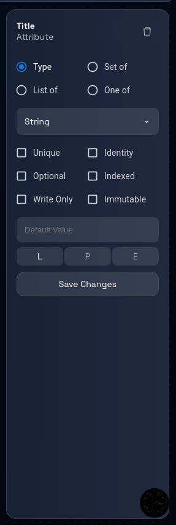
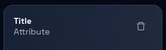
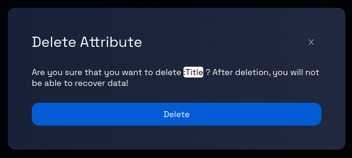

# Delete an Attribute

### **Step 1: Click on the Model Card**

In the Design Studio dashboard, click on the card representing the model you wish to edit. This will take you to the data model page for that particular model.

### **Step 2: Navigate Between Components (If Applicable)**

If the model contains more than one component, you can navigate between these components by clicking on the corresponding component tabs, which are usually displayed at the top and side of the page.

### **Step 3: Open the Attribute Panel**

Inside the entity box, locate the attribute’s badge you want to delete. Click on the attribute’s badge to open the attribute panel on the right-hand side of the page. This panel contains information related to the selected attribute.

### **Step 4: Delete the Attribute**

Within the opened attribute panel, locate and click on the "trash" icon. This icon is used to initiate the process of deleting the selected attribute.

### **Step 5: Confirmation Prompt**

After clicking the "trash" icon, you will receive a confirmation prompt to ensure you want to proceed with the deletion. This prompt is designed to prevent accidental deletion.

### **Step 6: Confirm Deletion**

In the confirmation prompt, review the message to ensure you indeed want to delete the attribute. If you are certain about the deletion, proceed by clicking the "Delete" button, as indicated in the prompt. To cancel the delete operation, click the `X` button on the top-right corner of the prompt.

### **Step 7: Attribute Deletion Process**

After confirming the deletion, Design Studio will begin the process of removing the selected attribute from the entity.

### **Step 9: Review and Continue**

Review the data model to ensure that the deleted attribute is no longer associated with the entity. You can now proceed with other actions, such as editing other attributes or working on different parts of the model.

Congratulations! You've successfully learned how to delete an attribute from an entity.
