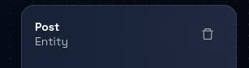
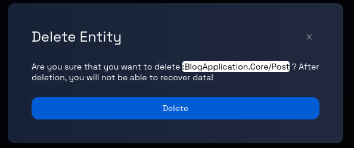

# Deleting an Entity from a Component

### **Step 1: Click on the Model Card**

Locate the model card that you want to add a component to. Click on the card representing the desired model. This will take you to the data model page for that particular model.

### **Step 2: Check for Existing Components**

If the model already contains components, they will likely be pre-selected when you access the model's Data model page.

If the model is empty, you must create a component following the instructions provided in the link: [How to Create a Component.](../components/create-component.md)

### **Step 3: Navigate Between Components (If Applicable)**

If the model contains more than one component, you can navigate between these components by clicking on the corresponding component tabs, which are usually displayed at the top and side of the page.

### **Step 4: Select the Entity**

On the data model's detailed page, choose the entity you want to delete:

- **Option 1:** Find the entity's name in the left panel and click on it.
- **Option 2:** Click on the entity itself (identified by a green border box) within the canvas.

### **Step 5: Open the Entity's Panel**

Upon selecting the entity, a panel will open on the right-hand side of the page. This panel typically contains information related to the chosen entity.

### **Step 6: Delete the Entity**

Within the opened entity panel, locate and click on the "trash" icon. This icon is used to initiate the process of deleting the selected entity.

### **Step 7: Confirmation Prompt**

After clicking the "trash" icon, you may receive a confirmation prompt to ensure you want to proceed with the deletion. This prompt is designed to prevent accidental deletion.

### **Step 8: Confirm Deletion**

If a confirmation prompt appears, review the message to ensure you indeed want to delete the entity. If you are certain about the deletion, proceed by clicking the "Delete" button, as indicated in the prompt.

### **Step 9: Entity Deletion Process**

After confirming the deletion, the platform will begin the process of removing the selected entity from the data model. Depending on the platform and the complexity of the entity, the deletion process might take a few seconds.

### **Step 10: Review and Continue**

Review the data model page to ensure that the deleted entity is no longer present. You can now proceed with other actions, such as editing other entities or adding new ones.

Congratulations! You've successfully learned how to delete an entity from a model using the steps outlined in this tutorial.