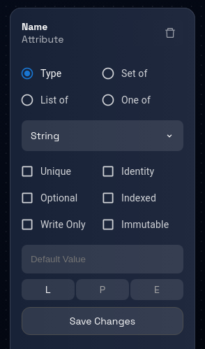
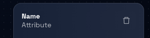
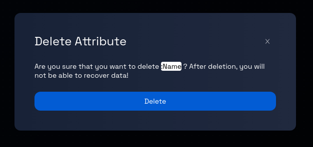

# Delete an Attribute

### **Step 1: Click on the Model Card**

Locate the model card that you want to add a component to. Click on the card representing the desired model. This will take you to the data model page for that particular model.

### **Step 2: Check for Existing Components**

If the model already contains components, they will likely be pre-selected when you access the model's Data model page.

If the model is empty, you must create a component following the instructions provided in the link: [How to Create a Component.](../components/create-component.md)

### **Step 3: Navigate Between Components (If Applicable)**

If the model contains more than one component, you can navigate between these components by clicking on the corresponding component tabs, which are usually displayed at the top and side of the page.

### **Step 4: Open the Attribute Panel**

Inside the record box, locate the attribute’s badge you want to delete. Click on the attribute’s badge to open the attribute panel on the right-hand side of the page. This panel contains information related to the selected attribute.

### **Step 5: Delete the Attribute**

Within the opened attribute panel, locate and click on the "trash" icon. This icon is used to initiate the process of deleting the selected attribute.

### **Step 6: Confirmation Prompt**

After clicking the "trash" icon, you may receive a confirmation prompt to ensure you want to proceed with the deletion. This prompt is designed to prevent accidental deletion.

### **Step 7: Confirm Deletion**

If a confirmation prompt appears, review the message to ensure you indeed want to delete the attribute. If you are certain about the deletion, proceed by clicking the "Delete" button, as indicated in the prompt.

### **Step 8: Attribute Deletion Process**

After confirming the deletion, the platform will begin the process of removing the selected attribute from the record. Depending on the platform and the complexity of the attribute, the deletion process might take a few moments.

### **Step 9: Review and Continue**

Review the data model to ensure that the deleted attribute is no longer associated with the record. You can now proceed with other actions, such as editing other attributes or working on different parts of the model.

Congratulations! You've successfully learned how to delete an attribute from a record using the steps outlined in this tutorial.