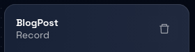
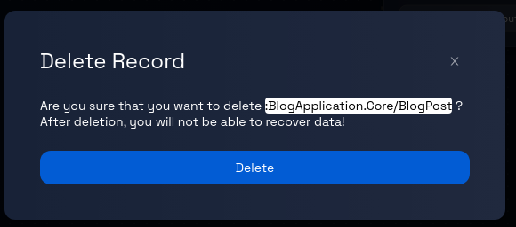

# Deleting a Record from a Component

### **Step 1: Click on the Model Card**

In the Design Studio dashboard, click on the card representing the model you wish to edit. This will take you to the data model page for that particular model.

### **Step 2: Navigate Between Components (If Applicable)**

If the model contains more than one component, you can navigate between these components by clicking on the corresponding component tabs, which are displayed at the top and side of the page.

### **Step 3: Select the Record**

On the data model's detailed page, choose the record you want to delete using one of the following methods:

- **Method 1:** Find the record's name in the left panel and click on it.
- **Method 2:** Click on the record itself (identified by a green border box) within the canvas.

### **Step 4: Open the Record's Panel**

Upon selecting the record, a panel will open on the right-hand side of the page. This panel will contain information related to the chosen record.

### **Step 5: Delete the Record**

Within the opened record panel, locate and click on the "trash" icon. This icon is used to initiate the process of deleting the selected record.

### **Step 6: Confirmation Prompt**

After clicking the "trash" icon, you will receive a confirmation prompt to ensure you want to proceed with the deletion. This prompt is designed to prevent accidental deletion.

### **Step 7: Confirm Deletion**

Read the message in the confirmation prompt to ensure you indeed want to delete the record. If you are certain about the deletion, proceed by clicking the "Delete" button. To cancel the delete operation, click the `X` button on the top-right corner of the prompt.

After confirming the deletion, Design Studio will begin the process of removing the selected record from the data model.

### **Step 8: Review and Continue**

Once the deletion process completes, review the data model page to ensure that the deleted record is no longer present. You can now proceed with other actions, such as editing other entities or adding new ones.

Congratulations! You've successfully learned how to delete a record from a model.
