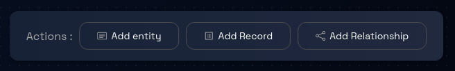
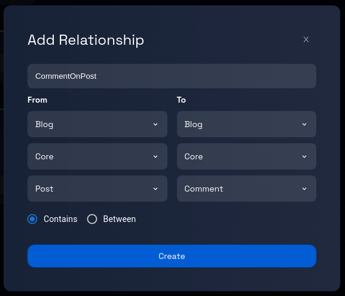
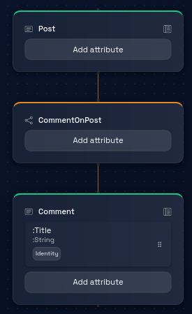

# Creating a Relationship in a Component

### **Step 1: Click on the Model Card**

Locate the model card that you want to add a component to. Click on the card representing the desired model. This will take you to the data model page for that particular model.

### **Step 2: Check for Existing Components**

If the model already contains components, they will likely be pre-selected when you access the model's Data model page.

If the model is empty, you must create a component following the instructions provided in the link: [How to Create a Component.](../components/create-component.md)

### **Step 3: Navigate Between Components (If Applicable)**

If the model contains more than one component, you can navigate between these components by clicking on the corresponding component tabs, which are usually displayed at the top and side of the page.

### **Step 4: Add a Relationship**

On the Data model page, locate and click on the "Add Relationship" button. Clicking the "Add Relationship" button will trigger the opening of a dialogue box where you can input information about the relationship you wish to create.

### **Step 5: Enter Relationship Details**

Within the dialogue box, you will find fields to fill in the following information:

- **Name**: Provide a name for the relationship to distinguish it within the model.
- **Type**: Specify the type of relationship, whether it is a "between" relationship or a "contains" relationship.
- **From Entity**: Select the entity from which the relationship originates.
- **To Entity**: Choose the entity to which the relationship is directed.
    

### **Step 6: Review and Verify**

Take a moment to review the relationship details you've entered to ensure correctness and clarity.

### **Step 7: Click "Create"**

When you're satisfied with the provided relationship details, locate the "Create" button within the dialogue box and click on it.

### **Step 8: Relationship Creation Process**

After clicking "Create," the platform will process your request and generate a new relationship between the specified entities within the chosen component.

The creation process might take a few seconds.

### **Step 9: Confirmation and Completion**

Upon successful relationship creation, you will see the box with the orange border connecting the entities.

### **Step 10: Continue Working with Components, Entities, and Relationships**

You can proceed to add more relationships or explore other features and options offered by the platform for data modeling and design.

Congratulations! You have successfully learned how to work with components and relationships in a model using the steps outlined in this tutorial