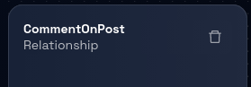
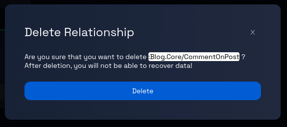

# Deleting a Relationship from a Component

### **Step 1: Click on the Model Card**

In the Design Studio dashboard, click on the card representing the model you wish to edit. This will take you to the data model page for that particular model.

### **Step 2: Navigate Between Components (If Applicable)**

If the model contains more than one component, you can navigate between these components by clicking on the corresponding component tabs, which are displayed at the top and side of the page.

### **Step 3: Select the Relationship**

On the data model's detailed page, choose the relationship you want to delete using one of the following methods:

- **Method 1:** Find the relationship's name in the left panel and click on it.
- **Method 2:** Click on the relationship itself (identified by a green border box) within the canvas.

### **Step 4: Open the Relationship’s Panel**

Upon selecting the record, a panel will open on the right-hand side of the page. This panel will contain information related to the chosen relationship.

### **Step 5: Delete the Relationship**

Within the opened relationship panel, locate and click on the "trash" icon. This icon is used to initiate the process of deleting the selected relationship.

### **Step 6: Confirmation Prompt**

After clicking the "trash" icon, you will receive a confirmation prompt to ensure you want to proceed with the deletion. This prompt is designed to prevent accidental deletion.

### **Step 7: Confirm Deletion**

In the confirmation prompt, review the message to ensure you indeed want to delete the relationship. If you are certain about the deletion, proceed by clicking the "Delete" button, as indicated in the prompt. (To cancel the delete operation, click the `X` button on the top-right corner of the prompt), If you confirm the deletion, Design Studio will begin the process of removing the selected relationship from the data model.

### **Step 10: Review and Continue**

Once the deletion process completes, review the data model page to ensure that the deleted relationship is no longer present.

Congratulations! You've successfully learned how to delete a relationship from a model.
