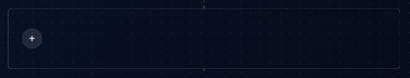
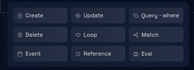

# Update

### Step 1: Navigate to the Dataflow Page

Navigate to the Dataflow Page by following these [steps](../../navigate-to-dataflow-page.md).

### **Step 2: Locate the Dataflow Container**

Identify the dataflow container that is connected to the event box with a purple border. This container represents the flow of data associated with the event.

### **Step 3: Add a Dataflow Pattern**

Inside the identified dataflow container, find the "+" button. Clicking on this button will open a menu with options for adding a dataflow pattern. Click on the "+" button to open the menu.

### **Step 4: Select a Dataflow Pattern**

In the menu that opens, you'll see a list of available dataflow patterns. Choose the appropriate dataflow pattern you want to add in this case **Update**.

### **Step 5: Enter Edit Mode**

By default, the dataflow pattern will be in preview mode. To make changes to the dataflow pattern, locate the "edit" icon, usually positioned at the header of the dataflow badge. Click on the "edit" icon to enter edit mode for the dataflow pattern.

### **Step 6: Configure the Entity and Alias**

Inside the edit mode interface, you can now configure the dataflow pattern:

**Select Entity:** Choose the entity you want to associate with the dataflow pattern from a dropdown menu.

**Assign Alias (Optional):** Optionally, assign an alias value to the dataflow pattern for easier reference.

### **Step 7: Add Query Criteria**

To assign query criteria, click on the "Add Query Criteria" button. This action will open a dialogue box. Inside the dialogue box, click on the "+" button to add query criteria.

### **Step 8: Configure Query Criteria**

In the query criteria dialogue box, configure the criteria:

**Select Attribute:** Choose the attribute you want to use for querying from a dropdown menu.

**Select Comparison Operator:** Choose the comparison operator (e.g., equals, greater than) from a dropdown menu.

**Enter Query Value:** Input the value you want to use for comparison in the provided input field.

To add more query criteria by clicking the "+" button again.

### **Step 9: Save Query Criteria**

Once you've added all necessary query criteria, click on the "Save" button within the dialogue box to save the query criteria.

### **Step 10: Add Upsert Criteria**

To add upsert criteria, click on the "Add Upsert Criteria" button. This action will open a new dialogue box. Inside the upsert criteria dialogue box, click on the "+" button to add upsert criteria.

### **Step 11: Configure Upsert Criteria**

In the upsert criteria dialogue box, configure the criteria:

**Select Attribute:** Choose the attribute you want to use for upserting from a dropdown menu.

**Enter Value:** Input the value you want to use for upserting in the provided input field.

To add more upsert criteria by clicking the "+" button again.

### **Step 12: Save Upsert Criteria**

Once you've added all necessary upsert criteria, click on the "Save" button within the dialogue box to save the upsert criteria.

### **Step 13: Click "Save"**

After configuring the dataflow pattern to your satisfaction, locate the "Save" button within the edit mode interface.

Click on the "Save" button to apply the changes you've made to the dataflow pattern.

### **Step 14: Dataflow Pattern Update**

The platform will process your changes and update the dataflow pattern according to your configurations.

The processing time may vary based on the complexity of the dataflow pattern and the platform's performance.

### **Step 15: Review and Continue**

Review the data model to ensure that the dataflow pattern has been updated as per your configurations. You can proceed with other actions, such as editing other dataflow patterns, entities, or attributes.

Congratulations! You've successfully learned how to add and edit **Update** dataflow patterns