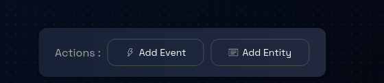
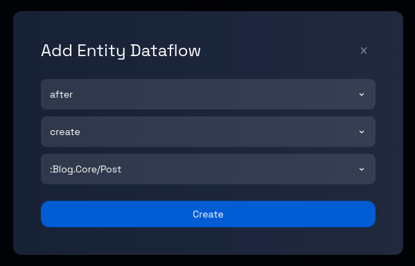
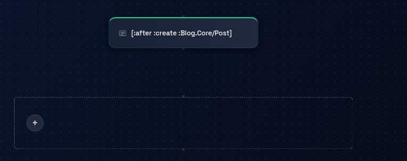

# Creating an Entity Dataflow in a Component

### Step 1: Navigate to the Dataflow Page

Navigate to the Dataflow Page by following these [steps](../navigate-to-dataflow-page.md).

### **Step 2: Add an Entity Dataflow**

On the dataflow page, locate and click on the "Add Entity" button. Upon clicking the "Add Entity" button, a dialogue box will appear, allowing you to input information about the entity dataflow you intend to create.

### **Step 3: Enter the Entity Dataflows's Detail**

Within the dialogue box, you will see the three dropdowns. Select the intended entiy dataflow's detail and click on create.

### **Step 4: Review and Verify**

Take a moment to review the details you've selected to ensure it accurately reflects the purpose of the entity dataflow.

### **Step 5: Click "Create"**

When you're confident with the selected details, locate the "Create" button within the dialogue box and click on it.

### **Step 6: Entity Dataflow Creation Process**

After clicking "Create," the platform will process your request and generate the new entity dataflow.

The creation process might take a few moments.

### **Step 7: Confirmation and Completion**

Upon successful event creation, you will likely a box with a green border representing the entity dataflow.

### **Step 8: Continue Working with Entity Dataflows**

You can continue adding more entity dataflows or explore other features and options provided by the platform for data modeling and design.

Congratulations! You've successfully learned how to work with entity dataflows in a model using the steps outlined in this tutorial