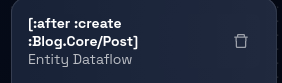
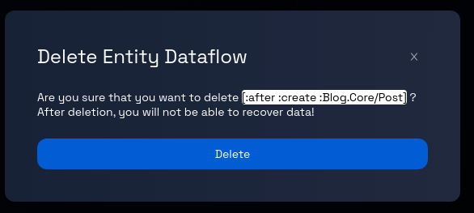

# Deleting an Entity Dataflow in a Component

### Step 1: Navigate to the Dataflow Page

Navigate to the Dataflow Page, and follow these [steps](../navigate-to-dataflow-page.md).

### **Step 2: Select the Entity Dataflow**

On the data model's detailed page, choose the entity dataflow you want to delete:

- **Option 1:** Find the entity dataflow's name in the left panel and click on it.
- **Option 2:** Click on the entity dataflow's itself (identified by a green border box) within the canvas.

### **Step 3: Open the Entity Dataflow's Panel**

Upon selecting the entity dataflow, a panel will open on the right-hand side of the page. This panel typically contains information related to the chosen entity dataflow.

### **Step 4: Delete the Entity Dataflow**

Within the opened entity dataflow panel, locate and click on the "trash" icon. This icon is used to initiate the process of deleting the selected etntiy dataflow.

### **Step 5: Confirmation Prompt**

After clicking the "trash" icon, you may receive a confirmation prompt to ensure you want to proceed with the deletion. This prompt is designed to prevent accidental deletion.

### **Step 6: Confirm Deletion**

If a confirmation prompt appears, review the message to ensure you indeed want to delete the entity dataflow. If you are certain about the deletion, proceed by clicking the "Delete" button, as indicated in the prompt.

### **Step 7: Entity Dataflow Deletion Process**

After confirming the deletion, the platform will begin the process of removing the selected entity dataflow from the data model. Depending on the platform and the complexity of the record, the deletion process might take a few seconds.

### **Step 8: Review and Continue**

Review the data model page to ensure that the deleted entity dataflow is no longer present. You can now proceed with other actions, such as editing other entities or adding new ones.