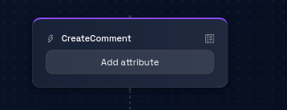
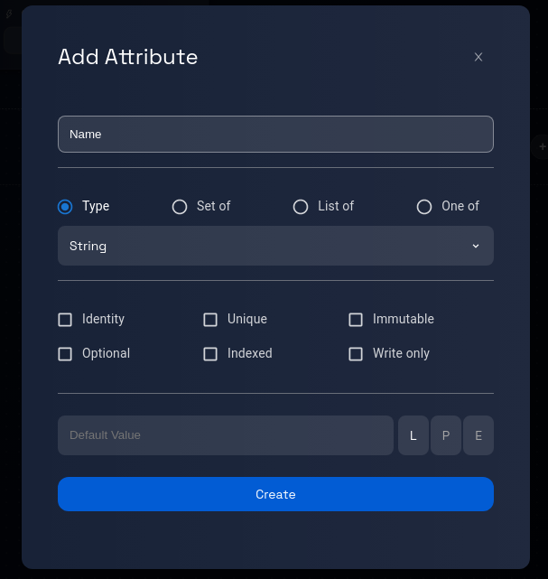
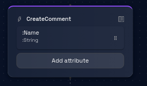

# Add an Attribute

### Step 1: Navigate to the Dataflow Page

Navigate to the Dataflow Page, and follow these [steps](../navigate-to-dataflow-page.md).

### **Step 5: Add an Attribute**

Inside the event box, look for the "Add Attribute" button. This button is used to initiate the process of adding a new attribute to the event.

Click on the "Add Attribute" button to open a dialogue box.

### **Step 6: Enter Attribute Details**

In the dialogue box, you'll be prompted to provide the following information:

- **Attribute Name:** Enter a descriptive name for the attribute you want to add to the event.
- **Attribute Type:** Select the appropriate type for the attribute from a list of available data types (e.g., text, number, date, etc.).
    

    

### **Step 7: Assign Identifier and Default Value (Optional)**

Depending on your needs and the platform's capabilities, you might have additional options to consider:

- **Identifier:** You can assign an identifier to the attribute to indicate uniqueness or other characteristics. This could include options like "unique," "optional," etc.
- **Default Value:** You can also assign an optional default value to the attribute, which is used when no specific value is provided.

### **Step 8: Review and Verify**

Take a moment to review the attribute name, type, identifier options, and default value (if applicable) to ensure accuracy.

### **Step 9: Click "Create"**

Once you are satisfied with the attribute details, locate the "Create" button within the dialogue box and click on it.

### **Step 10: Attribute Addition Process**

After clicking "Create," the platform will process your request and add the new attribute to the selected event.

Depending on the complexity of the event and the platform's performance, the attribute addition process might take a few moments.

### **Step 11: Confirmation and Completion**

Upon successful attribute addition, you will likely receive a confirmation message indicating that the attribute has been added to the event.

### **Step 12: Review and Continue**

Review the model to ensure that the new attribute has been successfully added to the event. You can now proceed with other actions, such as adding more attributes or working on other parts of the model.

Congratulations! You've successfully learned how to add an attribute to an event using the steps outlined in this tutorial.