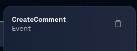
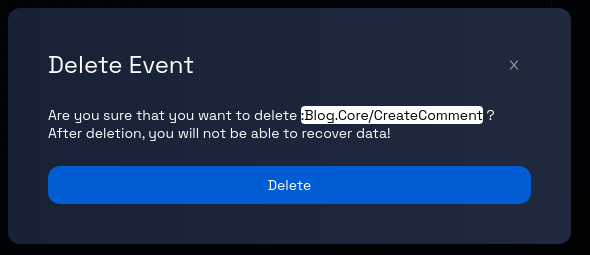

# Deleting an Event from a Component

### Step 1: Navigate to the Dataflow Page

Navigate to the Dataflow Page, and follow these [steps](../navigate-to-dataflow-page.md).

### **Step 2: Select the Event**

On the data model's detailed page, choose the event you want to delete using one of the methods below:

- **Method 1:** Find the event's name in the left panel and click on it.
- **Method 2:** Click on the event itself (identified by a purple border box) within the canvas.

### **Step 3: Open the Event’s Panel**

Upon selecting the event, a panel will open on the right-hand side of the page. This panel will contain information related to the chosen event.

### **Step 4: Delete the Event**

Within the opened event panel, locate and click on the "trash" icon. This icon is used to initiate the process of deleting the selected event.

### **Step 5: Confirmation Prompt**

After clicking the "trash" icon, you may receive a confirmation prompt to ensure you want to proceed with the deletion. This prompt is designed to prevent accidental deletion.

### **Step 6: Confirm Deletion**

In the confirmation prompt, review the message to ensure you indeed want to delete the event. If you are certain about the deletion, proceed by clicking the "Delete" button, as indicated in the prompt. To cancel the delete operation, click the `X` button on the top-right corner of the prompt.

If you confirm the deletion, Design Studio will begin the process of removing the selected event from the data model.

### **Step 7: Review and Continue**

Review the data model page to ensure that the deleted event is no longer present. You can now proceed with other actions, such as editing other entities or adding new ones.

Congratulations! You've successfully learned how to delete an event.
