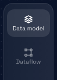

# Navigate to Dataflow Page

### **Step 1: Click on the Model Card**

In the Design Studio dashboard, click on the card representing the model you wish to edit. This will take you to the data model page for that particular model.

### **Step 2: Check for Existing Components**

If the model already contains components, they will likely be pre-selected when you access the model's Data model page.

If the model is empty, you must create a component following the instructions provided in the link: [How to Create a Component.](../data-model/components/create-component.md)

### **Step 3: Navigate Between Components (If Applicable)**

If the model contains more than one component, you can navigate between these components by clicking on the corresponding component tabs, which are displayed at the top and side of the page.

### **Step 4: Access the Dataflow Page**

From the Data model page, locate and click on a Dataflow button to navigate to the Dataflow page.

