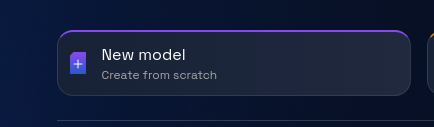
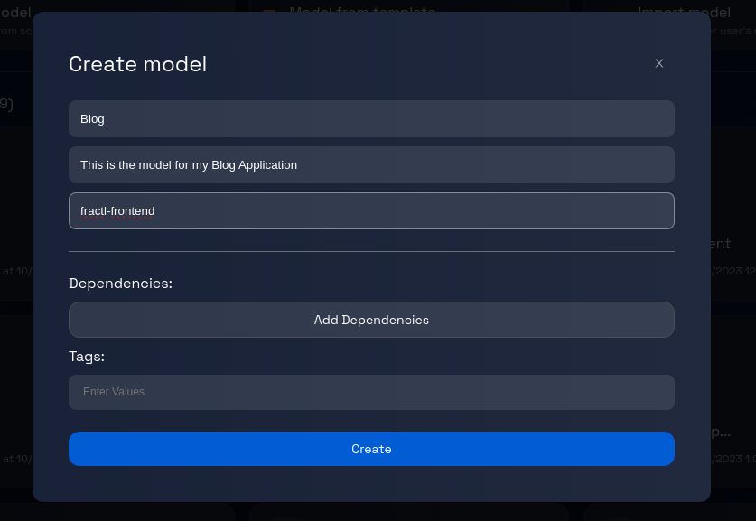
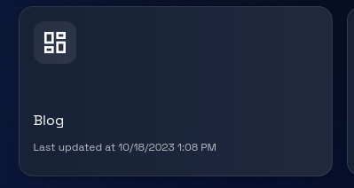

# Creating a Blank Model: Step-by-Step Guide

### **Step 1: Click on "New Model"**

In the Design Studio dashboard, locate and click on the "New Model" button.

### **Step 2: Fill in the Model Information**

Clicking on "New Model" will present you with a dialogue box with fields to fill in the following information about the model:

-   **Name**: A unique name for your model. The name should start with an alphabet and should contains only alpha-numeric characters.
-   **Description**: A brief description of the application.
-   **GitHub Organization**: The name of the GitHub organization where the code for the model will be stored.

### **Step 3: Create the Model**

Once you have verified the entered information, click the "Create" button at the bottom of the dialogue box.
Now Design Studio will initiate the process of creating a blank model based on the provided information.
This process might take a moment, so please be patient.
Once the model creation process is complete, you will see the model card appearing on the dashboard.

### **Step 4: Start Modelling the Application!**

At this point, you have successfully created a blank model.
You can double-click the model-card to define new components.
