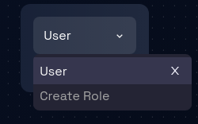

# Create Role

### **Step 1: Navigate to the Security Page**

Navigate to the Security Page by following these [steps](./navigate-to-security.md).

### **Step 2: Locate the Dropdown and Checkboxes**

Locate the dropdown where and click on it and in the dropdown you can see the **Create Role** option.

### **Step 3: Add a Role**

Click on the **Create Role** option, a dialogue box will open where you can write the name of the role and click on the create button. As a result new role will be added in the options of dropdown

