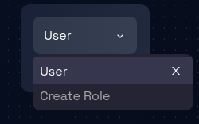

# Delete Role

### **Step 1: Navigate to the Security Page**

Navigate to the Security Page by following these [steps](./navigate-to-security.md).

### **Step 2: Locate the Dropdown and Checkboxes**

Locate the dropdown where and click on it and in the dropdown you can see the list of roles.

### **Step 3: Delete a Role**

Click on the **X** icon to delete a role, as a result the role will be deleted from the list.