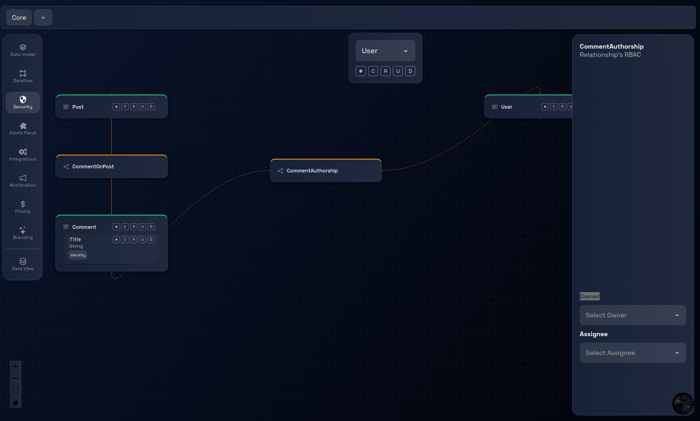
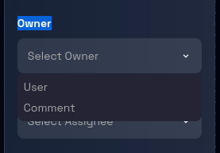
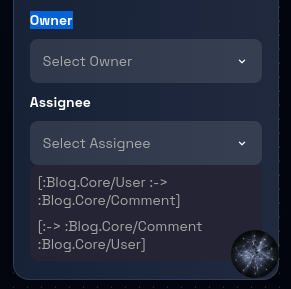

# Relationship - RBAC

### **Step 1: Navigate to the Security Page**

Navigate to the Security Page by following these [steps](./navigate-to-security.md).

### **Step 2: Open the Relationship's Panel**

Click on the between relationship to open the panel on the right side of the canvas where you can see the two dropdowns, one for selecting the Owner and one for Assignee.

### **Step 3: Select the Owner**

Click on the Owner dropdown to see the list of owners and select the owner option you want to select.

### **Step 3: Select the Assignee**

Click on the Assignee dropdown to see the list of assignees and select the assignee option you want to select.

